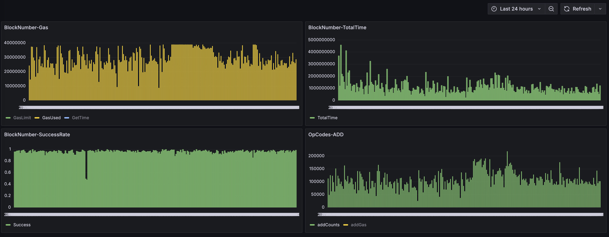

# Replayor Grafana Integration

This guide explains how to set up Grafana visualization for Replayor data.

## Prerequisites

1. Running Grafana instance (v9.0+)
2. Infinity plugin installed

## Setup Steps

In this case, we used docker to launch Grafana.

1. The json array obtained by replayor is used by the nginx proxy for the grafana data source

```
  nginx:
    image: nginx:latest
    container_name: nginx
    ports:
      - "8000:80"
    volumes:
      - ./nginx.conf:/etc/nginx/conf.d/default.conf
      - ../results/:/opt/grafana/data/:ro  # Use the path to the results folder
```

2. Config the data source of grafana.  (datasource.yml)

```
apiVersion: 1

datasources:
  - name: FileDatasource
    uid: replayor
    type: yesoreyeram-infinity-datasource
    access: "proxy"
    url: http://nginx/replay-250/51d3ea41ec62_1729159159  # the result file
```

3. Add the grafana dashboard (dashboard.json)

It's basically defined. (filepath: ./grafana/provisioning/dashboards/dashboard.json)
if you want to defined more panels, you can add it in this file.

4. launch grafana and nginx

```
docker-compose up -d
```

Effect picture:


I just definded a few panels, you can define more panels as you like.